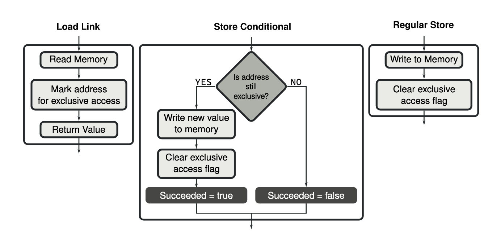

# Section 1 / Atomics


## Threads

Suppose you run two copies of the same program at the same time. They
both have a variable named `i`. Can a change to `i` made by one copy of
the program impact the value of `i` in the other running copy of the
program? Of course not.

Think of running two copies of a program at the same time as having
two identical, but distinct, homes. What happens inside one house does
not impact what happens inside the house next door.

Threads are a different way of getting more than one "copy" of a program
to run at the same time. Threads are different, however, in that they
all live within the same household. All of the housemates share the
living space and all housemates have access to any global or shared
resource. This makes for great gains in performance for a broad class
of problems but also introduces great hazards.

Suppose you buy a carton of milk and place it in the fridge. If you were
the only member of the household you would expect that when we next went
to the fridge your milk would still be there, right? If you share the
household with other people, this might not be the case.

Consider the following program:

```c++
#include <iostream>                                           // 1 
#include <thread>                                             // 2 
#include <atomic>                                             // 3 
#include <vector>                                             // 4 
                                                              // 5 
using std::cout;                                              // 6 
using std::endl;                                              // 7 
using std::atomic;                                            // 8 
using std::vector;                                            // 9 
using std::thread;                                            // 10 
                                                              // 11 
const uint32_t MAX_LOOPS = 10000;                             // 12 
const uint32_t NUM_THREADS = 16;                              // 13 
                                                              // 14 
/*  volatile is necessary if any use of the optimizer         // 15 
    is to be made.                                            // 16 
*/                                                            // 17 
volatile uint32_t naked_int;                                  // 18 
atomic<uint32_t> atomic_integer(0);                           // 19 
                                                              // 20 
extern "C" void LoadLinkedStoreConditional(uint32_t * value); // 21 
                                                              // 22 
void LLSCWorker() {                                           // 23 
    extern volatile uint32_t naked_int;                       // 24 
                                                              // 25 
    for (uint32_t i = 0; i < MAX_LOOPS; i++) {                // 26 
        LoadLinkedStoreConditional((uint32_t *) &naked_int);  // 27 
    }                                                         // 28 
}                                                             // 29 
                                                              // 30 
void NakedWorker() {                                          // 31 
    extern volatile uint32_t naked_int;                       // 32 
                                                              // 33 
    for (uint32_t i = 0; i < MAX_LOOPS; i++) {                // 34 
        naked_int++;                                          // 35 
    }                                                         // 36 
}                                                             // 37 
                                                              // 38 
void AtomicWorker() {                                         // 39 
    extern atomic<uint32_t> atomic_integer;                   // 40 
                                                              // 41 
    for (uint32_t i = 0; i < MAX_LOOPS; i++) {                // 42 
        atomic_integer++;                                     // 43 
    }                                                         // 44 
}                                                             // 45 
                                                              // 46 
void DoNaked() {                                              // 47 
    vector<thread *> threads;                                 // 48 
                                                              // 49 
    naked_int = 0;                                            // 50 
    for (uint32_t i = 0; i < NUM_THREADS; i++) {              // 51 
        threads.push_back(new thread(NakedWorker));           // 52 
    }                                                         // 53 
                                                              // 54 
    for (auto &t : threads) {                                 // 55 
        t->join();                                            // 56 
    }                                                         // 57 
}                                                             // 58 
                                                              // 59 
void DoLLSC() {                                               // 60 
    vector<thread *> threads;                                 // 61 
    naked_int = 0;                                            // 62 
                                                              // 63 
    for (uint32_t i = 0; i < NUM_THREADS; i++) {              // 64 
        threads.push_back(new thread(LLSCWorker));            // 65 
    }                                                         // 66 
                                                              // 67 
    for (auto &t : threads) {                                 // 68 
        t->join();                                            // 69 
    }                                                         // 70 
}                                                             // 71 
                                                              // 72 
void DoAtomic() {                                             // 73 
    vector<thread *> threads;                                 // 74 
                                                              // 75 
    for (uint32_t i = 0; i < NUM_THREADS; i++) {              // 76 
        threads.push_back(new thread(AtomicWorker));          // 77 
    }                                                         // 78 
                                                              // 79 
    for (auto &t : threads) {                                 // 80 
        t->join();                                            // 81 
    }                                                         // 82 
}                                                             // 83 
                                                              // 84 
int main() {                                                  // 85 
                                                              // 86 
    DoNaked();                                                // 87 
    DoAtomic();                                               // 88 
                                                              // 89 
    cout << "Correct sum is: ";                               // 90 
    cout << NUM_THREADS * MAX_LOOPS << endl;                  // 91 
    cout << "Naked sum: " << naked_int << endl;               // 92 
    cout << "Atomic sum: " << atomic_integer << endl;         // 93 
                                                              // 94 
    DoLLSC();                                                 // 95 
    cout << "LLSC sum: " << naked_int << endl;                // 96 
    return 0;                                                 // 97 
}                                                             // 98 
```

This program will spawn 16 threads which will each loop 10,000 times,
adding one to a zero-initialized integer each loop. At the end, when all
the threads complete, the integer should have the value 160,000.

Alas, this is an example of the class "Hidden Update" bug. The shared
resource, the integer, will get clobbered in unpredictable ways.

For example, multiple runs might produce (snipped to show only the
output from `NakedWorker()`):

- Naked sum: 74291
- Naked sum: 79390
- Naked sum: 89115
- etc

Not only are the results wrong, they are wrong in a different way each
time.

## Serializing Access to Integer Types

C++11 introduced the notion of *atomic integers*. These do not glow.
Rather, access to them is guaranteed to be atomic... as in, cannot be
broken down.

The hidden update problem's root cause is that adding (for example) to a
value in memory involves three instructions at the assembly language
level. A load, an addition, and a store. A hidden update occurs when a
thread is yanked from the CPU in the middle of these instructions. When
the thread returns to the CPU, the store causes its stale data to
overwrite (hide) correct data.

There are many ways to avoid the hidden update problem including a large
array of synchronization mechanisms. Alternatively, one can avoid the
hidden update problem by ensuring the three instruction sequence isn't
interrupted. This can be done using atomic integer types.

## Using Atomics

First, make the appropriate include:

`#include <atomic>`

Next, make the appropriate declaration and initialize the variable.
Here, replace "integral type" with some integer type:

`atomic<integral type> atomic_integer(0);`

Notice how the initial value is provided to the atomic variable's
constructor.

Finally, use the atomic variable as you would any other integer.

## A General Implementation

The newer ARM architectures provide a single instruction solution for
addition, subtraction and various bitwise operations. These will be
described below.

For ARMv8 and for later ARM versions (to perform operations other than
those listed above), there is a general solution that isn't pretty. It
is an example of Load Linked / Store Conditional. It isn't pretty
because it involves a loop.

```asm
        .text                                                 // 1 
        .p2align    2                                         // 2 
                                                              // 3 
#if defined(__APPLE__)                                        // 4 
        .global     _LoadLinkedStoreConditional               // 5 
_LoadLinkedStoreConditional:                                  // 6 
#else                                                         // 7 
        .global     LoadLinkedStoreConditional                // 8 
LoadLinkedStoreConditional:                                   // 9 
#endif                                                        // 10 
1:      ldaxr       w1, [x0]                                  // 11 
        add         w1, w1, 1                                 // 12 
        stlxr       w2, w1, [x0]                              // 13 
        cbnz        w2, 1b                                    // 14 
        ret                                                   // 15 
```

Lines 1 and 2 are boilerplate.

The conditional assembly block from line 4 through line 10 declare the
label `LoadLinkedStoreConditional` as global for both Linux and Apple
assemblers. The label itself is also stated.

It is worth explaining that labels marked as global must have an
underscore prefix for Apple assembly.

This function is passed the address of an `int32_t`.

Line 11 loads the value found at that address into `w1` and also marks
the address as needing watching (by the hardware).

Line 12 can be expanded and / or replaced with whatever operation needed
to be done on the value.

Line 13 puts the potato on the fork. It is a store conditional which may
or may not actually write anything to memory.

To understand this instruction, [Kristien et
al](../../reference_material/USENIX2020.pdf) et al. provide this
amazingly helpful picture:



The value returned in `w2` will be 0 of the store actually took place
and will have the value of 1 if the store was rejected.

Imagine the following:

| T1 | T2 |
| -- | -- |
| Executes line 11. Gets value *N*. Location is marked. | |
| T1 is descheduled. | |
| | Executes line 11. Gets value *N*. Location is marked again. |
| | `w1` goes up to *N + 1* on line 12. |
| | Line 13 succeeds in storing *N + 1* to memory and <br/> the location marking is cleared |
| | T2 is descheduled. |
| T1 is scheduled - recall it has stale values. | |
| Executes line 12 making *N + 1* which is now wrong. | |
| Executes line 13 which fails because the marking is now gone. | |
| Loops around, this time picking up *N + 1* | |
| Correctly makes *N + 2* | |

## Implementation of ARMv8.1A and Newer

Implementations of operations on atomic variables were improved in the
second version of ARMv8, called ARMv8.1. The load linked and store
conditional instructions are still available but several new
instructions were added which perform certain operations such as
addition, subtraction and various bitwise operations in a single atomic
instruction.

For example:

```asm
    mov       w1, 1
    ldaddal   w1, w0, [x0]
```

does the same work of atomically adding one to the value in memory
pointed to by `x0`.
