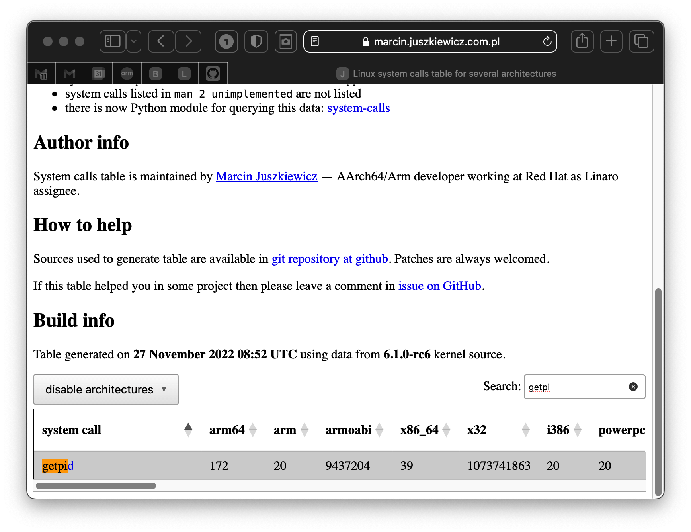

# Under the hood: System Calls

The term "function" is used many places in this book and needs no
additional explanation here. The term "system call" has also been used
in many places, often with a comment that making a system call through
the C runtime is actually just calling an ordinary function acting as
a wrapper. An explanation of this has been promised...

## Wrappers

"Wrapper" is a term used to describe a function which hides the details
of something else, often another function or functions. Hiding details
is a form of abstraction and can be a good thing. Broadly speaking,
an API (Application Programmer's Interface) is itself another example
of wrappers in common use.

## C runtime as a wrapper

Many C runtime functions are just wrappers for system calls. For example
if you call `open()` from the C runtime, the function will perform a few
bookkeeping operations and then make the actual system call.

## What IS a system call?

The short answer is a system call is a sort-of function call that is
serviced by the operating system itself, within its own private region
of memory and with access to internal features and data structures.

Our programs run in "userland". The technical name for userland on the
ARM64 processor is EL0 (Exception Level 0).

We can operate within the kernel's space only through carefully
controlled mechanisms - such as system calls. The technical name for
where the kernel (or system) generally operates is called EL1.

There are two higher Exception Levels (EL2 and EL3) which are beyond
the scope of this book.

## Mechanism of making a system call

First, like any function call, parameters need to be set up. The first
parameter goes in the first register, etc.

Second, a number associated with the specific system call we wish to
make is loaded in a specific register (`w8`).

Finally, a special instruction `svc` causes a trap which elevates us out
of userland into kernel space. Said differently, `svc` causes a
transition from EL0 to EL1. There, various checks are done and the
actual code for the system call is run.

A description of returning from a system call is beyond the scope of
this book. Hint: just as there's a special instruction that escalates
from EL0 to EL1, there is a special instruction that does the reverse.

## What is the number associated with a particular system call?

Hard question.

In a perfect world, each Linux distribution would use the same set of
system call numbers. But no.

[This](https://marcin.juszkiewicz.com.pl/download/tables/syscalls.html)
is the most comprehensive list of system call numbers we have seen. It
shows system call numbers for many architectures and distributions.

## Example: calling `getpid()`

The system call `getpid()` fetches the running process's process ID.
Every executing entity has one.

We present four different versions of the same program:

1. Written in C++

2. Written in C

3. Written using C runtime from assembly language

4. Calling the system call directly from assembly language

### Written in C++

```c++
#include <iostream>                                               // 1 
#include <unistd.h>                                               // 2 
                                                                  // 3 
using std::cout;                                                  // 4 
using std::endl;                                                  // 5 
                                                                  // 6 
int main() {                                                      // 7 
    cout << "Greetings from: " << getpid() << endl;               // 8 
    return 0;                                                     // 9 
}                                                                 // 10
```

### Written in C

```c
#include <stdio.h>                                                // 1 
#include <unistd.h>                                               // 2 
                                                                  // 3 
int main() {                                                      // 4 
    printf("Greetings from: %d\n", getpid());                     // 5 
    return 0;                                                     // 6 
}                                                                 // 7
```

### Written in assembly language using C runtime

```text
        .global main                                              // 1 
        .text                                                     // 2 
        .align  2                                                 // 3 
                                                                  // 4 
main:   stp     x29, x30, [sp, -16]!                              // 5 
        bl      getpid                                            // 6 
        mov     w1, w0                                            // 7 
        ldr     x0, =fmt                                          // 8 
        bl      printf                                            // 9 
        ldp     x29, x30, [sp], 16                                // 10 
        mov     w0, wzr                                           // 11 
        ret                                                       // 12 
                                                                  // 13 
        .data                                                     // 14 
fmt:    .asciz  "Greetings from: %d\n"                            // 15 
                                                                  // 16 
        .end                                                      // 17
```

### And finally: calling the system call directly

```text
        .global main                                              // 1 
        .text                                                     // 2 
        .align  2                                                 // 3 
                                                                  // 4 
main:   stp     x29, x30, [sp, -16]!                              // 5 
        mov     x8, 172                 // getpid on ARM64        // 6 
        svc     0                       // trap to EL1            // 7 
        mov     w1, w0                                            // 8 
        ldr     x0, =fmt                                          // 9 
        bl      printf                                            // 10 
        ldp     x29, x30, [sp], 16                                // 11 
        mov     w0, wzr                                           // 12 
        ret                                                       // 13 
                                                                  // 14 
        .data                                                     // 15 
fmt:    .asciz  "Greetings from: %d\n"                            // 16 
                                                                  // 17 
        .end                                                      // 18
```

We chose `getpid()` because it doesn't require any parameters. Using
the C runtime, we simply `bl` to it. Calling the system call directly
is different in that we must first load `x8` with the number that
corresponds to `getpid()` for the AARCH64 architecture.

Consulting [this](https://marcin.juszkiewicz.com.pl/download/tables/syscalls.html)
awesome website, we find that the number we want is 172.



The constant specific to the system call we want is loaded into `x8`.
Recall that `x0` through `x7` are scratch registers.

Then on line 7, the `svc` with the argument 0 initiates the escalation
from EL0 to EL1 where the kernel implements our desired functionality
and returns to us.

### Review

System calls are functions implemented inside the operating system.

To get there, at some point perhaps behind a wrapper function found in
the CRT (C Run Time library), a distro specific system call number is
placed in `x8` with other scratch registers getting the system call's
documented parameters and the `svc` instruction is executed with
argument 0.

### Preference

We suggest using the CRT wrapper functions where possible because:

* They are easier to code

* They are portable between distributions of the OS
