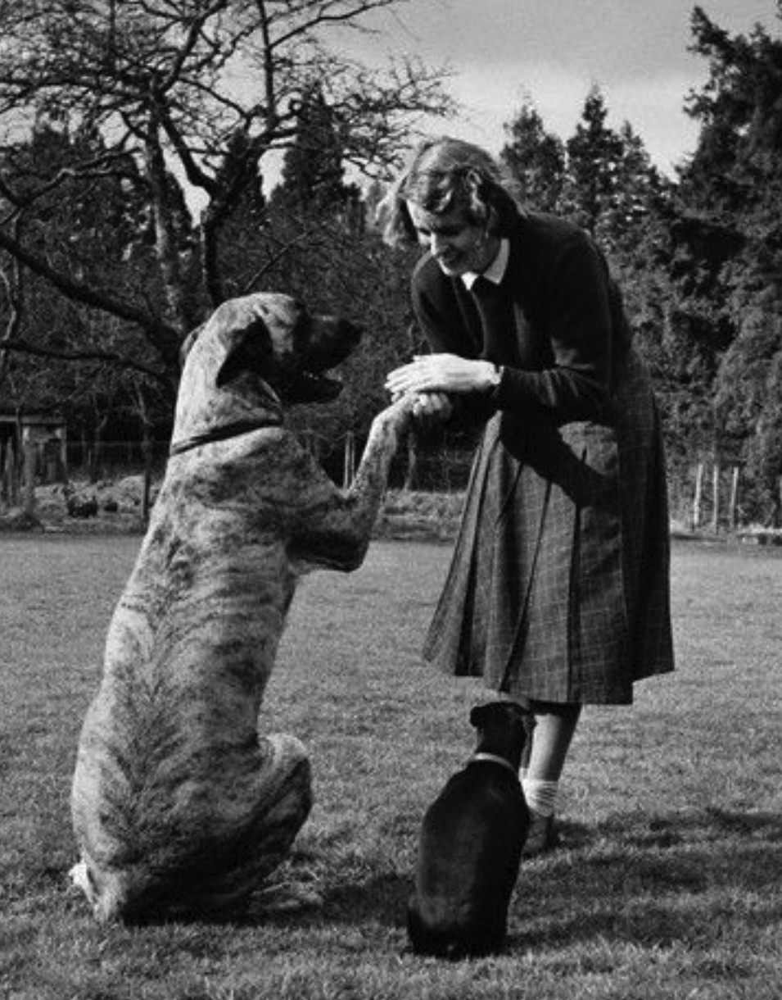

# Walkies

Your program will animate a single character back and forth across the
terminal in such a way that it appears to walk. OK, tumble across the
screen might be more correct but then titling this page *Tumbling*
wouldn't have the same ring.


## Overview

Looking at these characters in sequence:

| Order | Character | Comment |
| ----- | --------- | ------- |
| 0 | \| | below delete key - this is called the pipe character |
| 1 | / | slash |
| 2 | _ | underscore |
| 3 | \\ | bash |

Notice how the characters can be repeated to approximate a tumbling
animation.

You will loop these characters in such a way that they will be drawn
marching first to the right across the screen and then back to the left
as in the animation above.

The width of the tumbling range will be 60 (the animation above shows a
width of 40 but you are to use 60).

The program runs forever... terminate it with ^c (control-c).

## Use of Carriage Return To Cause Redrawing

After emitting a full line of characters, your cursor must be forced
back to column 0. You can accomplish this by emitting `\r` as almost 
the last
thing you print. This is the carriage return... think getting to the end
of a line on an old time typewriter.


Kermit must be writing in assembly language because all the lines he's
typing are very short.

## Do You Need Any Spaces To The Right Of The Character?

Asking for a friend.

## Forcing Output Without New Lines in C++

You're used to this:

```c++
cout << "Foo" << endl;
```

The `endl` is doing two things for you:

1. Of course, it's giving you a new line but it is also...
2. Triggers the output to actually render on your console

Actual output via streams like `cout` and `cerr` only happens
when new lines are emitted. This is called "buffering". Buffering is
a powerful technique to increase efficiency when:

* the amount of output is a little at a time

* output is made frequently

* the cost of emitting the output is high

In C++, to force output that's been buffered up in an output stream, 
(without requiring a new line), do:

```c++
cout.flush();
```

or

```c++
cout << blah << flush;
```

The choice of the method name `flush()` is apropos in that you're
"flushing" any buffered characters all the way to their ultimate end
point.

Note that `cout` can be replaced with the name of any output stream.

## Forcing Output In Assembly Language

This program can use the low level `write()` which is *not* buffered
to emit characters on-demand. `write()` looks like this:

```c
ssize_t write(int fildes, const void *buf, size_t nbyte);
```

where:

* `ssize_t` means a 64-bit integer.

* `fildes` is a file descriptor - a value of 1 means console out.

* `buf` is a pointer to the data to be printed.

* `nbyte` is the number of characters to print.

## Causing A Delay in C++

Since C++ 11, the standard library has provided a portable means of
delaying execution of your program, a *pause* in other words. To use
this method you need the following includes:

```c++
#include <chrono>
#include <thread>
```

When it is time to delay, use the following:

```c++
this_thread::sleep_for(chrono::milliseconds(MILLISECONDS_DELAY));
```

## Causing A Delay in Assembly Language

Once again, we'll use lower level functions. In this case, we'll use
`usleep()` where the `u` stands in for `mu`, the Greek letter
indicating microseconds, millionths of a second.

`usleep()` looks like this:

```c
int usleep(useconds_t microseconds);
```

* `useconds_t` is a synonym for `int`.

## Barbara Woodhouse

[Barbara Woodhouse](https://en.wikipedia.org/wiki/Barbara_Woodhouse) was
a pre-Internet phenom world renowned dog trainer. From her, "Walkies!"
and "Sit tah!" entered the world's lexicon.

Here she is:



## Sample Implementation

A sample implementation can be found [here](./main.s). Try this
yourself first before looking at our code.
