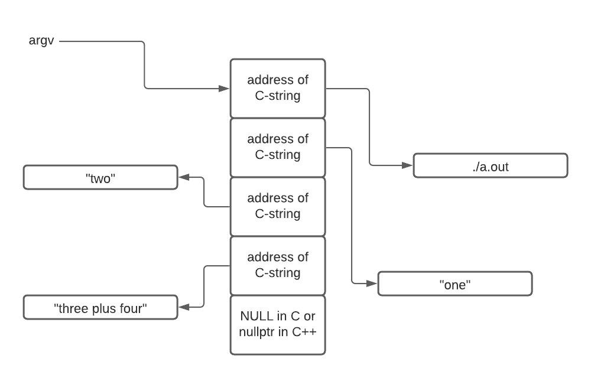

# Section 1 / Hello World

## Overview

We start out with a C++ program kind-of-like "Hello World" and break it
down into several versions which are closer and closer to a high level
assembly language (otherwise known as C). At the last step, we convert
the C into ARM V8 assembly language.

At every step, we'll completely explain the code and document what has
changed from version to version so that little background is assumed.

[Special Bonus](#special-bonus---build-on-linux-and-apple-silicon) can
be found by following the link. The code found there uses the macro
suite developed by the author that allows code to be written once and
built on both the Mac M family as well as on Linux.

## V1 in C++

Here is the code to a program that prints to the console, the contents
of `argv`, that is: the command line arguments specified when the
program is run from the shell (command line).

```c++
#include <iostream>                                         // 1 
                                                            // 2 
using namespace std;                                        // 3 
                                                            // 4 
int main(int argc, char * argv[]) {                         // 5 
    while (*argv) {                                         // 6 
        cout << *(argv++) << endl;                          // 7 
    }                                                       // 8 
    return 0;                                               // 9 
}                                                           // 10
```

[Here](./v1.cpp) is a link to the program without line numbers.

Here is the output of this program:

```text
% ./a.out one two "three plus four"
./a.out
one
two
three plus four
% 
```

As you can see in the output, the program printed each of the command
line parameters (arguments) in the order in which they were specified.
These come to your program stored in an array called (by convention)
`argv` as the second parameter to `main()`.

### Line 1

`Line 1` makes available the default output stream `cout`. `cout` stands
for `c`onsole `out`put. The angle brackets (`<` and `>`) indicate the
include file `iostream` comes from a language or system supplied
directory as opposed to an include file written by you.

For an explanation of what an `include` file is and how it fits into the
compilation workflow see [here](https://youtu.be/Iv3psS4n9j8).

### Line 3

`Line 3` is a common statement in C++ programs. It allows the use of
many standard library features such as `cout` by typing fewer
characters. In this case, for example, `line 7` without the `line 3`
`using` would read:

```c++
std::cout << *(argv++) << std::endl;
```

There are other reasons to specify a `using namespace` and even some
reasons *not* to specify a `using namespace`. These however, are not
relevant to this discussion.

### Line 5

`Line 5` is a function declaration declaring `main`. In command line
programs (and indeed in many non-command line programs), a function
called `main` is necessary.

In all respects save one, `main` is an ordinary user-written function.

What makes `main` special is its name and its parameters (typically
called `argc` and `argv`). A function named `main` is special because by
default it is the function at which your code will begin execution.

`argc` is an integer argument which specifies the number of *non-null*
arguments found by following the *pointers* contained in the array
`argv`. We will explain *non-null* and *pointers* later.

In the case of the execution portrayed above, `argc` would have the
value of `4`. `argc` **always** has a value of at least 1. This is
because the first command line argument accessible via `argv` is the
*path* to the program being executed. For our purposes, think of the
*path* as like the *name* of the program.

`argv` is declared as a *pointer to one or more pointers to chars*. The
concept of a *pointer* is essential to understanding assembly language.
*Pointers* are scary for new programmers. They don't have to be. When
you see the word *pointer*, think *address of* something.

*"pointer to a pointer"* like `argv` sounds even more scary but if you
think of pointers as *address of*, then *"pointer to a pointer"* means
something which contains the address of something else which itself hold
the address of a thing.

In this case, the first *something* is `argv`. It contains the address
of an array holding 1 or more addresses of null terminated strings.

Here is a picture depicting this:



#### Explanation of "non-null"

The above diagram also illustrates what we mean by *non-null*.

*argc* contains the value of 4 in the case depicted by the image.
Looking at the array pointed to by `argv` you will notice **5** boxes
(or *elements*) arranged in a succession of memory locations. The last
is filled with a 0 or `NULL`. The first 4 entries are non-null (i.e.
they contain a value other than 0).

The last element in the array contains a `NULL` in C (or `nullptr` in
C++) is not counted by `argc` because it is, in fact, a null.

Be reminded that null is the value of `0`. We will use this fact (that
the last value in the array is `0` to our advantage).

In our enumeration of `argv` we will leverage the fact that the last
element is `NULL` to avoid the overhead of a loop variable serving as an
index.

### Line 5 Continued

One final comment about `line 5` is that it currently reads

```c++
char * argv[]
```

accentuating the array property of `argv` but it could equivalently
have been written:

```c++
char ** argv
```

accentuating the *pointer to a pointer* (i.e. two successive `*`)
quality of `argv`. Here the `*` indicates *pointer*. Two in a row means
*pointer to a pointer*.

### Line 6

```c++
while (*argv) {
```

introduces a `while` loop. The code (i.e. the *body* of the loop) will
repeatedly execute *as long as* the value inside the parenthesis is
found to be `true` (i.e. non-zero or specifically in our case
*non-null*). The loop will stop when `*argv` contains 0 (NULL).

Somewhere inside the body of the loop, the value of `argv` will be
changed. If it were not, the loop would not terminate (i.e. an *infinite
loop*).

#### Line 6 could be redone as a `for` loop in more than one way

`Line 6` in this case could have been written using a `for` loop:

```c++
for (int index = 0; index < argc; index++)
```

Using this approach will result in more assembly language code being
generated including the introduction of an otherwise unneeded variable
`index`. `index` will range from `0` to `3` (stopping when index ceases
to be less than `4`). `index` would be used in figuring out which member
of `argv` is examined in each loop. We claim `index` is unneeded in this
case as we have a different way of moving through the `argv` array and,
most importantly, knowing when to stop.

Or, it could have been rewritten as a `for` loop in this way:

```c++
for (; argv; argv++)
```

which is almost identical to the `while` version with added benefit that
the increment of the `argv` pointer is not a side effect.

### Line 7

`Line 7` is where the action is. Firstly, `cout` will receive some value
for printing. `cout` is an output stream and the `<<` indicates
something is being shoved into it - i.e. is being output.

At the end of `line 7` is `endl`. This is a C++ shorthand for printing a
new line. In total, `line 7` prints something followed by advancing the
output to a new line.

#### What will be printed?

`*(argv++)` is complicated. Let's break it down.

We examine what is inside the parentheses first (as demanded by the rules
governing the *order of operations*).

The value of `argv` is captured first. Recall this value is the address
of an address of some characters. This value is put aside for a moment
but will be used very soon.

Next the value of `argv` is incremented (the `++`). We know the value of
`argv` is captured first because the `++` comes *after* `argv`. This is
how `argv` changes so as to step through the elements of the array. At
some point `argv` will contain the address of a value `0` - and that's
what will terminate the `while` loop.

After `argv` is incremented, its **previous** value is *dereferenced*
indicated by the `*` outside the parentheses. Remember, we put the value
aside before incrementing it.

`argv` contains the address of something. Dereferencing `argv` means "go
fetch what is found at the address specified by `argv`".

That, dear reader, is the address of the string of characters to be
printed. Or, it is a NULL, telling us to stop.

#### Style warning

Many would argue that the post increment found within the sending of
output to `cout` is bad style. We would count ourselves among those who
would consider this ill-considered.

Why? Because a print out isn't a likely place to expect to find
something that changes the state of the program. The increment found
here can be considered a *side effect*. Side effects are, in general,
bad. Try to avoid them. Yes, they can make your code a few lines shorter
but this comes at the expense of maintainability.

So, do as we say, not as we did.

Putting the increment on its own line will make it more clear and remove
it as a side effect making the code more maintainable. Or, you could use
the `for` construction described [earlier](#line-6-could-be-redone-as-a-for-loop-in-more-than-one-way).

### Line 8

`Line 8` contains a matching brace for the opening brace found line
`line 6`. This marks the end of the `while` loop's *body*. The `}`
causes a **jump** back to evaluating what is pointed to by argv to see
if it is now null (which exits the loop). A synonym for **jump** is
**branch** - remember this.

Also remember that braces in a higher level language can mean a branch
or jump in assembly language. A brace in a higher level language can
also mean a *target* or landing place for a jump / branch elsewhere in
the code.

### Line 9

This program is itself invoked by another program (in this case the
shell). The value returned by `main` is received by the program that
launched this program. `Line 9` causes the shell to be able to receive
the value 0 which, by convention, means our program exited normally.

Here's how to see a program's return value:

```text
$ ./a.out
$ echo $?
0
$
```

The `0` is the program's return code.

## V2

Here is version 2 of our program:

```c++
#include <iostream>                                          // 1 
                                                             // 2 
using namespace std;                                         // 3 
                                                             // 4 
int main(int argc, char * argv[]) {                          // 5 
    top:                                                     // 6 
        if (*argv) {                                         // 7 
            cout << *(argv++) << endl;                       // 8 
            goto top;                                        // 9 
        }                                                    // 10 
    return 0;                                                // 11 
}                                                            // 12 
```

[Here](./v2.cpp) is the original file.

In this version, we've moved a bit closer to assembly language by
eliminating the `while` loop replacing it with an `if` statement, a
`label` and a `goto`.

### Line 6

This line is a `label`. This is not an instruction, rather it is a way
of specifying the address of an instruction (or data). Labels exist in
assembly language, `while` loops do not, per se. Rather, you must code
them yourself using some kind of *branch* instruction (remember above
the word *branch*?) in this case the `goto`.

### Line 7

The `while` loop has been removed. It has been replaced with explicit
use of an `if` statement at what was the top of the loop and a `goto`
branch at what was the bottom. This is how `while` loops are
implemented. Now we're explicitly making this visible. For more
information on `while` loops see [here](../while/README.md)

### Line 9

The use of `goto` is normally frowned upon in modern higher level
languages. However, the feature or ability to use it still remains, left
over from the earliest days of C. The keyword `goto` is followed by the
label to which control should transfer. `goto` is an example of a branch
and the label `top` is the *target* of the branch.

## V3

In version 3 we eliminate the C++'ism of `cout`. `cout` doesn't exist in
assembly language so we'll use `puts()` instead to implement the same
behavior of the use of `cout` - namely the printing out of what is
pointed to by `*argv` *and* printing out a new line (done internally for
us by `puts()`).

`puts()` comes to us from the standard C runtime.

At this point, there is no C++ left - only C.

 ```c++
 #include <stdio.h>                                         // 1 
                                                            // 2 
int main(int argc, char * argv[]) {                        // 3 
    top:                                                    // 4 
        if (*argv) {                                        // 5 
            puts(*(argv++));                                // 6 
            goto top;                                       // 7 
        }                                                   // 8 
    return 0;                                               // 9 
}                                                          // 10 
```

[Here](./v3.cpp) is the original code.

### Line 6

`puts()` as described above takes the address of a C string and prints
it out with the addition of a trailing new line. What's going on inside
the parentheses is identical to the previous versions.

To review:

* the current value of `argv` is put aside for reuse in a
moment. Then `argv` is incremented. Recall that `argv` is "the address
of a variable holding the address of a string." Incrementing `argv` has
the effect of moving on to the next string for the *next* iteration of
the loop or, causes the loop to terminate.

* then, the *previous* value of `argv` which we set aside, is
dereferenced. `*argv` is the address of a string. That string is emitted
by `puts()` followed by a new line.

## Version 4

In this version we're decomposing the `if` statement even further so as
to eliminate the braces that were part of the previous version's `if`
statement.

In general, braces in the higher level language serve as either branches
or as labels in assembly language.

```c
#include <stdio.h>                                          /* 1 */
                                                            /* 2 */
int main(int argc, char * argv[]) {                         /* 3 */
    top:                                                    /* 4 */
        if (*argv == NULL)                                  /* 5 */
            goto bottom;                                    /* 6 */
        puts(*(argv++));                                    /* 7 */
        goto top;                                           /* 8 */
                                                            /* 9 */
    bottom:                                                 /* 10 */
        return 0;                                           /* 11 */
}                                                           /* 12 */
```

[Here](./v4.c) is the original code.

### Line 5

Notice how the sense of the `if` statement has reversed compared to the
previous version. This is a convenience.

In the previous version, we call `puts()` only if the value of `*argv`
is not null. By flipping the sense of the `if` statement, it means "if
the value of `*argv` **is** null, skip calling `puts()`."

This isn't a requirement. In this case, flipping the sense of the `if`
statement results in fewer lines of assembly language.

### Line 6

We exit our decomposed loop by branching to a label beyond the `goto`
implementing the bottom of what was our `while` loop.

At this point we have devolved our program into just barely above the
level of assembly language. In the next version, which is written in ARM
V8 assembly language, you'll see that just about every instruction has a
one to one correspondence to the C code in version 4.

## Version 5 - in Assembly Language

Here is the same program written in ARM V8 assembly language.

```asm
    .global main                                                        // 1 
main:                                                                   // 2 
    stp     x21, x30, [sp, -16]!    // push onto stack                  // 3 
    mov     x21, x1                 // argc -> x0, argv -> x1           // 4 
                                                                        // 5 
top:                                                                    // 6 
    ldr     x0, [x21], 8            // argv++, old value in x0          // 7 
    cbz     x0, bottom              // if *argv == NULL goto bottom     // 8 
    bl      puts                    // puts(*argv)                      // 9 
    b       top                     // goto top                         // 10 
                                                                        // 11 
bottom:                                                                 // 12 
    ldp     x21, x30, [sp], 16      // pop from stack                   // 13 
    mov     x0, xzr                 // return 0                         // 14 
    ret                                                                 // 15 
                                                                        // 16 
    .end                                                                // 17 
```

[Here](./v5.s) is the original code.

Get your bearings by noticing the labels. They are the same as in our
previous version and perform the same roles.

### Line 1

`main()` is a function that is specially named. `Line 1` instructs the
assembler to make the name and location of `main()` visible to the
*linker*. To refresh your knowledge of the linker, see
[here](https://youtu.be/Iv3psS4n9j8).

Without `Line 1`, building the executable will fail with an unresolved
symbol error - namely that the linker could not find `main`.

### Line 2

In `Line 1` we told the assembler to publish the location of the label
`main`. In `Line 2` we're actually specifying the value of `main`.
Contrast `main` with `top` and `bottom`. The difference between them is
that only `main` is made visible outside this file.

Again, in the case of `main`, the label must be specified as `global` so
that the linker can find it. `top` and `bottom` are also labels but they
are not published outside this one source file.

### Line 3

This instruction copies the value in two *registers* onto your *stack*.
There's a lot of new information here.

*Registers* are ultra high speed storage locations built into the
circuitry of the processor. On the ARM, all computation takes place in
the registers (with very few exceptions). Memory, with very few
exceptions, is used to persist data (and hold instructions). In a higher
level language, when you say:

```c++
x = x + 1;
```

the assembly language this looks like:

1. Load the memory address of x into a register.

2. Go out to that memory address and fetch what it contains into a
   register (a dereference).

3. Add one to that value (in the register).

4. Store the value back to memory using the address loaded on line 1.

The thing to note here is that the increment of x didn't happen in
memory - it happened in a register. The value in x had to be loaded into
a register, incremented in the register and finally written back to
memory. By careful design, use of memory for persisting data can be
avoided completely. This makes for very fast execution because registers
are one or more orders of magnitude faster than RAM.

The *stack* is a region of memory used to store *local* variables as
well as the trail of breadcrumbs which allows functions to return from
whence they were invoked. In a high level language, you don't manage the
stack yourself. Stacks just happen.

In a higher level language, values go onto the stack (push) and leave
the stack (pop) passively by virtue of having made function calls and
declaring local variables. In assembly language *you* manage the stack!

`Line 3` `st`ores a `p`air of registers on the stack. `stp` means *store
pair*. The registers being copied to the stack are `x21` and `x30`.
`x30` is special as it contains the address to which this function
should return. It is the "breadcrumb" mentioned before.

`x30` gets overwritten every time a function call is made. If `main()`
made no function calls itself, `x30` would not have to be backed up.
However, this `main()` does make function calls (to `puts()`).

If we don't *save* `x30` on the stack when `main` initially enters, our
ability to properly return to whoever called `main` would be broken by
the function call to `puts()`. In all likelihood when this program ended
it would cause a crash.

`x21` is also being saved on the stack. *Calling conventions* specify
some registers can be blown away (used as scratch) while some registers
must be preserved and restored to their previous values upon leaving the
function. `x21` is one of those registers.

`x21` will be used in `main` so its original value must be preserved.

Finally let's look at `[sp, -16]!`. There's a lot going on here.

First, the `[` and `]` serve the same purpose of the asterisk in C and
C++ indicating "dereference." It means use what's inside the brackets as
an address for going out to memory.

Next, `sp` means use the stack pointer - a register which keeps track of
where your stack currently is. The `-16` subtracts 16 from the current
value of the stack register. `x` registers like `x21` and `x30` are each
8 bytes (64 bits) wide. This accounts for the value 16 (i.e. 2 \* 8.

Lastly, the exclamation point means that the stack pointer should be
changed (i.e. the -16 applied to it) *before* the value of the stack
pointer is used as the address in memory to which the registers will be
copied. Again, this is a predecrement.

**The stack pointer in ARM V8 can only be manipulated in multiples of
16.**

**The stack pointer in ARM V8 can only be manipulated in multiples of
16.**

**The stack pointer in ARM V8 can only be manipulated in multiples of
16.**

In a higher level language `Line 3` would look like this:

```c++
// Stack grows towards smaller addresses. Traditionally, 
// diagrams of memory place 0 at the top and higher
// addresses down below. Hence, the saying that "stack
// grows upward upwards."
*(--sp) = x30;  // the 2nd arg of stp goes on the stack 1st
*(--sp) = x21;  // the 1st arg of stp goes on the stack 2nd
```

In a diagram the results of `stp x21, x30, [sp, -16]!` looks like this:

| address | value |
| ------- | ----- |
| smaller address | x21 |
| larger address | x30 |

File this information away as it makes understanding
[variadics](../../more/varargs/) easier to understand on the Apple M
series. Note `variadic` functions are an advanced topic.

A previous version of this text contained an error. This new version is
inspired by user `4rnee` on Github to whome we owe thanks.

**The stack pointer in ARM V8 can only be manipulated in multiples of
16.**

**The stack pointer in ARM V8 can only be manipulated in multiples of
16.**

**The stack pointer in ARM V8 can only be manipulated in multiples of
16.**

### Line 4

When a function is passed parameters, up to 8 of them can be found in
the first 8 scratch registers (`x0` through `x7`). For example, recall:

```c++
main(int argc, char ** argv)
```

`argc` is the first parameter. It shows up to the function in register
`x0`. This is a slight oversimplification because `x` registers are 64
bits wide and `int` is 32 bits wide. The simplification isn't relevant
here so let's continue.

`argv` is the second parameter to `main`. Being second, it shows up in
`main` in register `x1`.

`x0` through `x7` are truly scratch registers - they can be overwritten
with new values at any time by you or when calling other functions (like
`main` will call `puts`). Because of this, `argv` that arrives in `x1`
is preserved in `x21` (whose original value we already preserved on the
stack).

```asm
mov   x21, x1
```

can be read as `copy what is in x1 into x21`. I.e. read the register use
from right to left.

The `mov` instruction doesn't *move* anything anywhere. It *copies*.

## Line 6

This line contains the label `top`. The instruction that follows (the
`ldr`) is stored at some address. The value of `top` is that address.
The unconditional branch on `line 10` specifies `top` as the destination
of the branch. You can think of `line 10` as the closing brace of the
original while loop.

## Lines 7, 8 and 9

Version 4 contains:

```c++
5) if (*argv == NULL)
6)    goto bottom;
7) puts(*(argv++));
```

These three lines are implemented on `lines 7, 8 and 9` in the assembly
language. These instructions are:

```asm
7)   ldr   x0, [x21], 8
8)   cbz   x0, bottom
9)   bl    puts
```

The action of the assembly language statement differs slightly in the
order in which the C++ operates.

In both cases, `argv` is dereferenced first. In C++ this is done with
`*argv`. In the assembly language, this is done with `[x21]` (recall, we
put `x1` into `x21`).

In C++ the increment of `argv` is done on line 7 - the `++` post
increment. In the assembly language, the post increment is done on `line
7` which is the *first* instruction of the three whereas in C++ the post
increment happens on the *last* line of three.

This difference is OK because the older value of `argv` is preserved in
`x0` for the call to `puts()`. As long as we can get at the value of
`argv` before the increment, it doesn't matter when the increment is
done.

Why is that value of 8 on line 7? Recall that all addresses in this
64 bit ISA are... 8 bytes long. To move our gaze from one pointer to
the next within an array of pointers, we must increment by 8.

The *if* happens on the first line of the C++ but done on the middle
line of the assembly language. `cbz` stands for *`C`onditionally
`B`ranch if `Z`ero*.

The `goto` or branch happens on the middle line (`line 8`) of the
assembly language. Very economical in terms of code!

`puts()` is called with the un-incremented version of `argv` in the C++
version - again notice the use of post increment. In the assembly
language version this is also the case. How? `argv` before the increment
was put in `x0`. That value is still sitting in `x0` when the function
call (`bl`) is made.

A word about `bl`: `B`ranch with `L`ink puts the address of the *next*
(`line 10`) instruction into `x30` behind the scene. This is why we
backed up `x30` on `line 3`. When `puts` executes its return (via
`ret`), control will branch to `line 10`.

## Line 10

`Line 10` is exactly the same as `line 8` of Version 4. It hides out as
the closing brace on `line 8` of Version 1.

## Lines 13, 14 and 15

`Lines 13` through `15` implement the return of zero found on `line 11`
of Version 4. The original values of `x21` and `x30` are restored. The
stack pointer is post incremented back to where it started. Zero is put
in `x0` and `main` returns.

## Summary

Assembly language is scary to a lot of people. It doesn't need to be.

We have shown one small example of how close C is to assembly language.
With a little practice, one can code in assembly language at pretty much
the same speed as C. We are not advocating the ditching of your high
level languages rather... always use the *right* tool for the *right*
job.

We do maintain that understanding assembly language principles will
improve your higher level language coding.

## Special Bonus - Build on Linux AND Apple Silicon

Apple does things differently. Even in the simple program we have been
discussing there are differences that must be accounted for. To do this
on a broad scale we offer a macro suite that abstracts the differences
between the M series and Linux.

[Here](./no_macros.s), presented first, is the source code adapted for
the M series without the benefit of our macro suite:

```text
    .global _main                                                   // 1 
                                                                    // 2 
_main:                                                              // 3 
    stp     x21, x30, [sp, -16]!    // push onto stack              // 4 
    mov     x21, x1                 // argc -> x0, argv -> x1       // 5 
                                                                    // 6 
    top:                                                            // 7 
    ldr     x0, [x21], 8            // argv++, old value in x0      // 8 
    cbz     x0, bottom              // if *argv == NULL goto bottom // 9 
    bl      _puts                    // puts(*argv)                 // 10 
    b       top                     // goto top                     // 11 
                                                                    // 12 
    bottom:                                                         // 13 
    ldp     x21, x30, [sp], 16      // pop from stack               // 14 
    mov     x0, xzr                 // return 0                     // 15 
    ret                                                             // 16 
                                                                    // 17 
    .end                                                            // 18 
```

The only changes are the handling of external symbols like `main` and
`puts`. Building this program is simply:

`gcc no_macros.s`

The code above source code will assembly and link correctly on the M
series Macs. The suggestion to add the version without the macro suite
comes from `laurent b` on `github`. They correctly pointed out that
jumping directly into macros in this first chapter was a pretty jarring
leap.

Next we'll consider the version using our macro suite which will
assemble and build on both the M series and ARM-based Linux systems.

[Here](./v6.S) is the source code shown below.

[Here](./apple-linux-convergence.S) is the source code to the macro
suite that allows you to write the code once and build on both the Apple
M family and upon Linux.

The documentation can be found [here](./../../macros/).

```text
#include "apple-linux-convergence.S"                        // 1 
                                                            // 2 
        .text                                               // 3 
        .p2align    2                                       // 4 
        GLABEL      main                                    // 5 
                                                            // 6 
MAIN                                                        // 7 
        PUSH_P      x21, x30                                // 8 
        PUSH_R      x29                                     // 9 
        mov         x29, sp                                 // 10 
                                                            // 11 
        mov         x21, x1                                 // 12 
                                                            // 13 
1:      ldr         x0, [x21], 8                            // 14 
        cbz         x0, 2f                                  // 15 
        CRT         puts                                    // 16 
        b           1b                                      // 17 
                                                            // 18 
2:      POP_R       x29                                     // 19 
        POP_P       x21, x30                                // 20 
        mov         x0, xzr                                 // 21 
        ret                                                 // 22 
                                                            // 23 
        .end                                                // 24 
```

The push and pop macros simply save typing but the other macros sense
if you are building on Linux or on Apple M family. In this case, the
macros are helping with underscores but the macro suite contains more
sophisticated helpers as well.

## Questions

### 1

(T | F) It is the compiler's job to reduce a higher level language to
assembly language.

Answer: True - The "compiler" is just one step in the "compilation"
process. In fact it is step 2. Invoking the "preprocessor" is step 1.

### 2

(T | F) Failing to mark `main` as a `global` will result in a syntax
error.

Answer: False - a linker error will happen, not a syntax error.

### 3

\___ and ___ implement the braces in C and C++.

Answer: labels and branches - the closing brace of a `while` loop for
example, is a branch instruction. The opening brace of a `while` is a
label.

### 4

(T | F) The `cbz` instruction implements the following pseudocode:

```text
if a_register has value 0
    then goto label
```

Answer: True - `cbz` stands for "compare and branch if zero". There is
also a `cbnz` instruction. To test for other Boolean conditions, use
`cmp`.

### 5

While this chapter is entitled "Hello World," the example used isn't
actually "Hello World." Here is a "Hello World" for you to complete:

```text
   .global main                                                       
main:                                                                 
    str     x30, [sp, -16]!         // Preserve x30
    ldr     x0, =HW                 // Load address of string for puts
    WHAT GOES HERE?                 // puts(HW)                    
    ldr     x30, [sp], 16           // Restore x30
    mov     x0, xzr                 // return 0                        
    ret                                                                

    .data
HW: .asciz  "Hello, World"
    .end                                                              
```

Answer:

```text
    bl      puts
```
