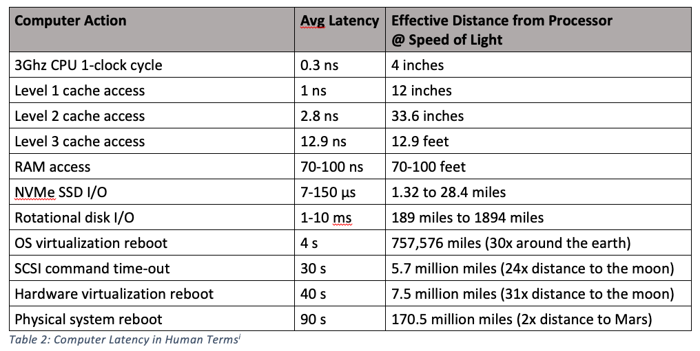

# Section 1 / Interlude - Registers

We have discussed and used registers in the previous chapters without
explanation. This chapter introduces the concept of registers and
explains why registers are critical.

## Types of Registers

Of general interest, the ARM 64 bit ISA offers a large register set for
integer types and another for floating point types.

The register set designed for integer types are indicated by `x` and `w`
variants. The two variations are coincident - `w0` for example, is the
same underlying register as `x0`. The choice of letter (`x` or `w`)
determines how the register is interpreted.

* The `x` registers are for `long` integers and addresses.
* The `w` registers are used for the narrower integer types. While `w`
  stands for *word*, these registers are also used for `short` and
  `char`.

The registers used for floating point types (and vector operations) are coincident:

* `q` registers are a massive 16 bytes wide - quad words.
* `v` registers are also 16 bytes wide and are synonyms for the `q`
  registers.
* `d` registers for `doubles` which are 8 bytes wide - double precision.
  2 per `v`.
* `s` registers for `floats` which are 4 bytes wide - single precision.
  4 per `v`.
* `h` registers for `half precisions floats` which are 2 bytes wide. 8
  per `v`.
* `b` registers for byte operations. 16 per `v`.

## Why Registers

In most (all?) of the programming you may have done prior to learning assembly language, you've taken it for granted that
variables are located somewhere in RAM. This has been a convenient fiction. In reality, virtually all interaction with a
variable takes place in a register rather than in RAM. Indeed, a well written assembly language program can often do away
with RAM to a large degree by careful use of registers.

What you think of as:

```c++
i = i + 1;
```

is really:

```text
1. load the address of `i` into an `x` register
2. dereference the `x` register to get the value of `i` from RAM into another register
3. add one to it
4. use the address previously loaded to store the value back to RAM 
```

Modern processors that are not slaves to backwards compatibility have fewer and fewer instructions that operate directly upon data in RAM. This is largely because of the stupendous difference in speed at which a processor can access its registers versus the speed at which a processor can access memory.

The following two images are from the [Formulus Black Blog](https://formulusblack.com/blog/compute-performance-distance-of-data-as-a-measure-of-latency/) and are quite informative. Note this has become a dead link. Most unfortunate.

This image relates typical latency (delay) in gaining access to data in various places.


This says that if we liken accessing a register (which can be done at *least* once per CPU Clock Cycle) to one second, accessing RAM would be like a 3.5 to 5.5 minute wait.

In the next image, the relative latencies within a computer are expressed in a different way: What is the *effective distance* of a device from the CPU expressed in terms of the *speed of light.* Here, registers can be thought of as being less than 4 inches away from the CPU. Main memory, on the other hand, would be 70 to 100 feet away.



Resist the urge to cling tightly to the idea of data being only found in RAM.

In order to manipulate data, the data must be loaded into registers.

**YOU ARE THE HUMAN!** With planning and forethought YOU can arrange for the data you need most to be resident in registers rather than in RAM. In fact, ideally, you can organize your code and algorithms to minimize the dependence upon RAM and in some cases, you can write whole sophisticated programs using RAM for little more than a place to store string literals.

## Summary

Registers are truly "where the action is."

Very few instructions on the ARM 64 bit ISA can manipulate the contents of RAM directly because of the enormous disparity between processor and memory speeds.

Foreshadowing a more advanced topic, whenever CS people encounter devices operating at hugely different speeds, they feel compelled to create `caching systems`. Caches are, to use a technical term, *good*.
