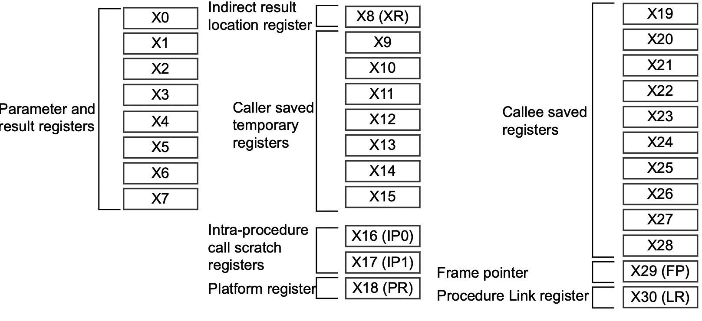

# Backing up and Restoring Registers

While it is true that there are 31 general purpose registers (the `x` and coincident `w` registers), they aren't all equally general purpose. First, let's call out the different categories of general purpose registers:

* `x30` is the **Link Register**
* `x0` through `x7` are truly scratch registers.
* `x9` through `x15`  are registers you can't count on being preserved by functions called by your function. If you need them to be preserved, you must preserve and restore them yourself.
* `x19` through `x28` are registers you must back up and restore if you use them.
* `x8`, `x16` through `x18` and `x29` are used by compilers in support of the magic they do.



The above image is due to ARM and is found [here](https://documentation-service.arm.com/static/5fbd26f271eff94ef49c7018).

## What Does "Preserving" a Register Mean?

To backup (or "preserve") a register is copying the register onto the stack (i.e. storing a copy of the register in RAM). The `str` and `stp` instructions are used for this.

## What Does "Restoring" a Register Mean?

To restore a register means copying a previously stored copy of the contents of a register from the stack (RAM) back to the register. The `ldr` and `ldp` instructions are used for this.

## Always Manipulate the Stack in Multiples of 16

Any change you make to `sp` must be a multiple of 16.

Here is an example:

```asm
        .global main                                                    // 1 
        .text                                                           // 2 
        .align  2                                                       // 3 
                                                                        // 4 
main:   str     x30, [sp, -8]!                                          // 5 
        ldr     x30, [sp], 8                                            // 6 
        ret                                                             // 7 
```

which produces:

```text
regs > ./a.out
Bus error (core dumped)
regs >
```

## Link Register

`x30` is the Link Register, a register which is automatically used to store the return address when a function call is made (i.e. the `bl` instruction). Indeed, the `bl` instruction is called Branch with Link.

Nearly all functions have the implicit assumption that, at some point, they will return to whence they were called. Exceptions to this, of course, are functions like `exit()` and `exec()` family of functions.

Here's a fun program:

```asm
        .global main                                                    // 1 
        .text                                                           // 2 
        .align  2                                                       // 3 
                                                                        // 4 
main:   mov     x30, xzr                                                // 5 
        ret                                                             // 6 
                                                                        // 7 
        .end                                                            // 8 
```

```text
regs > ./a.out
Segmentation fault (core dumped)
regs >
```

So short. So sweet. So lethal.

Manipulating the `x30` register is done automatically by the `bl` and `ret` instructions.

The `bl` performs these steps:

* Compute the address of the instruction following the `bl`
* Put that address into `x30`
* Put the address of the function being called into the Program Counter

Note that the Program Counter always contains the address of the next instruction to be executed. Loading a new value into the Program Counter causes a branch to take place. The Program Counter is a register but it is not one of the general purpose registers. Its mnemonic is `pc`.

The `ret` instruction copies the contents of `x30` into the `pc`, causing a branch to that address (which ought to be where the function was called from).

The program above crashes because `line 5` obliterates the address to which `main()` was supposed to return.

### Exception to Needing to Protect `x30`

If your function:

* does not itself modify `x30` and
* does not itself call any other functions

then you do not need to backup and restore `x30`.

## `x0` through `x7`

These registers are truly scratch.

* You can modify them at any time
* You cannot count on their values surviving any function call you make

Note these registers are used to convey up to 8 parameters to functions.

## `x9` through `x15`

These registers are free for you to use **but** if you call other functions, you cannot count on them being what they were when a function returns. If you need these values to be preserved across function calls, you have to preserve them.

## `x19` through `x28`

These registers are free for you to use **but** if you modify them, you **must** preserve them.

## `x8`, `x16` through `x18` and `x29`

While these registers *are* general purpose registers and you *can* use them, compilers use these to facilitate certain functions they do including easing the use of a debugger. If you're flitting back and forth from assembly language to higher level languages you might think about avoiding their use. `x29` in particular is known as the `frame pointer` and is used for debugging. It will be explained in more detail elsewhere.

## Restatement

| Registers | Preserve? |
| --------- | --------- |
| `x0`...`x7` | All bets are off - no promised made |
| `x9`...`x15` | If you are counting on their value across function calls, you must preserve them |
| `x19`...`x28` | If you use them you must preserve them |
