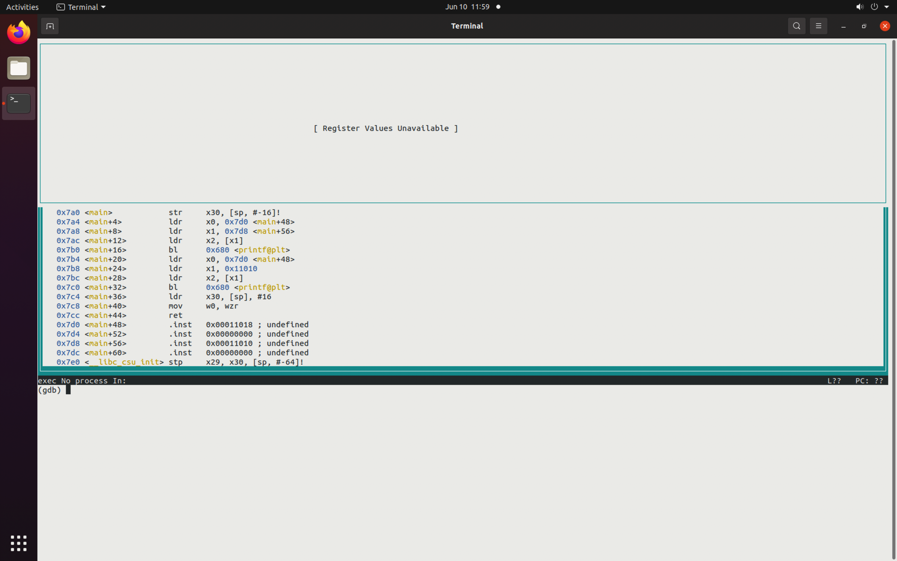
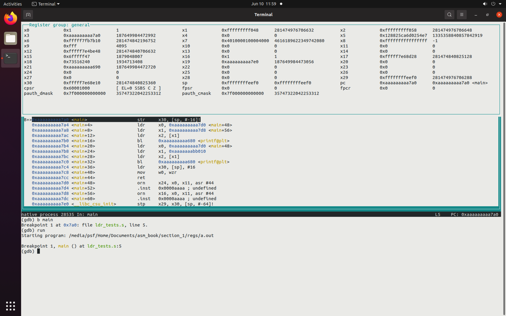
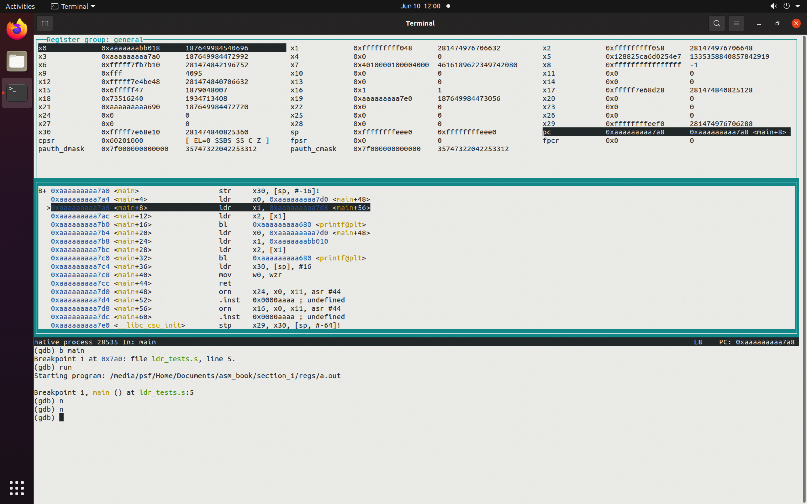
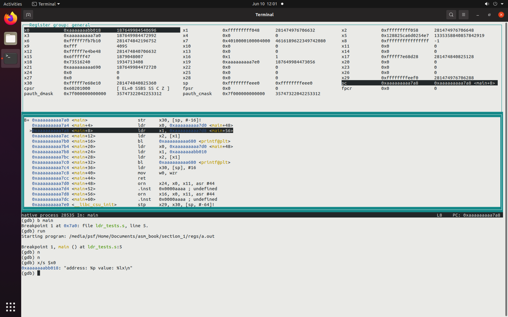
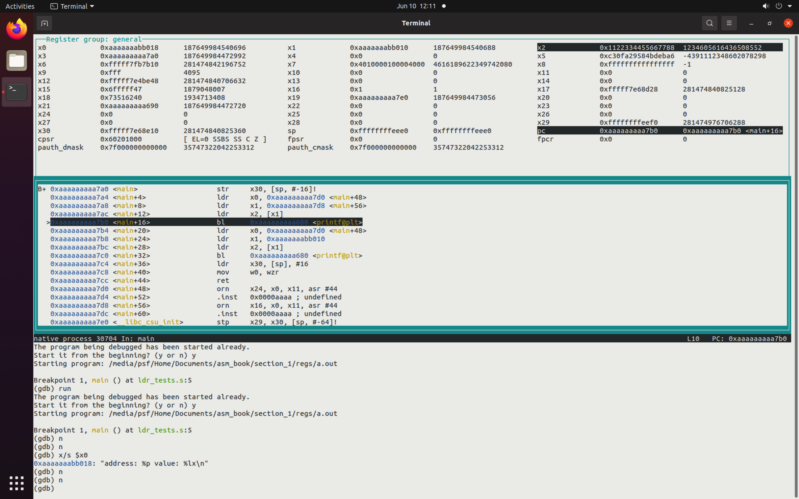

# More About `ldr`

## Overview

In this chapter we examine the difference between loading the address of (a pointer to)
a data label versus loading the data at the label. Both use the `ldr` instruction
however, the assembler actually does some trickery behind the scenes to accomplish
the loads.

## Length of Instructions

All AARCH64 instructions are 4 bytes in width.

## Length of Pointers

All AARCH64 pointers are 8 bytes in width.

## How to Specify an Address Too Big to Fit in an Instruction?

The title of this section sets the table for the need for trickery. All labels
refer to addresses. Addresses are 8 bytes in width but all instructions are 4
bytes in width. Clearly, we cannot fit the full address of a label in an
instruction.

Some ISA's (not ARM) have variable length instructions. The instruction may be
four bytes wide but it tells the CPU that the next eight bytes are an operand
of the instruction. Thus the true instruction width is 12 bytes. This is not
true of the ARM ISA.

**All instructions are 4 bytes wide. All of them.**

## "`ldr` xregister, =label" is a Pseudo Instruction

When you assemble an instruction looking like:

```text
    ldr     x1, =label
```

the assembler puts the address of the label into a special region of memory
fancily called a "literal pool." What matters is this region of memory is placed
immediately after (therefore nearby) your code.

Then, the assembler computes the difference between the address of the current
instruction (the `ldr` itself) and the address of the data in the literal pool
made from the labeled data.

The assembler generates a different `ldr` instruction which uses the difference
(or offset) of the data relative to the program counter (`pc`). The `pc` is
non-other the address of the current instruction.

Because the literal pool for your code is located nearby your code, the offset
from the current instruction to the data in the pool is a relatively **small**
number. Small enough, to fit inside a four byte `ldr` instruction.

```text
    ldr    x1, [pc, offset to data in literal pool]
```

## Example Program for Demonstrating Use of Literal Pool

[Here](./ldr_tests.s) is a sample program demonstrating the difference
between:

```text
    ldr    x1, =q
```

and 

```text
    ldr     x1, q
```

Note the difference is that the first has an `=` sign before the label
and the second does not.

Also note, that when `line 15` is executed, the program will **crash**.

```text
        .global     main                                                        // 1 
        .text                                                                   // 2 
        .align      2                                                           // 3 
                                                                                // 4 
main:   str         x30, [sp, -16]!                                             // 5 
                                                                                // 6 
        ldr         x0, =fmt                    // Loads the address of fmt     // 7 
        ldr         x1, =q                      // Loads the address of q       // 8 
        ldr         x2, [x1]                    // Loads the value at q         // 9 
        bl          printf                      // Calls printf()               // 10 
                                                                                // 11 
                                                                                // 12 
        ldr         x0, =fmt                    // Loads the address of fmt     // 13 
        ldr         x1, q                       // Loads the VALUE at q         // 14 
        ldr         x2, [x1]                    // CRASH!                       // 15 
        bl          printf                                                      // 16 
                                                                                // 17 
        ldr         x30, [sp], 16                                               // 18 
        mov         w0, wzr                                                     // 19 
        ret                                                                     // 20 
                                                                                // 21 
        .data                                                                   // 22 
q:      .quad       0x1122334455667788                                          // 23 
fmt:    .asciz      "address: %p value: %lx\n"                                  // 24 
                                                                                // 25 
        .end                                                                    // 26 
                                                                                // 27 
```

Disassembling the binary machine code of the executable generated with the
above source code will include:

```text
0000000000007a0 <main>:
 7a0:	f81f0ffe 	str	x30, [sp, #-16]!
 7a4:	58000160 	ldr	x0, 7d0 <main+0x30>
 7a8:	58000181 	ldr	x1, 7d8 <main+0x38>
 7ac:	f9400022 	ldr	x2, [x1]
 7b0:	97ffffb4 	bl	680 <printf@plt>
 7b4:	580000e0 	ldr	x0, 7d0 <main+0x30>
 7b8:	580842c1 	ldr	x1, 11010 <q>
 7bc:	f9400022 	ldr	x2, [x1]
 7c0:	97ffffb0 	bl	680 <printf@plt>
 7c4:	f84107fe 	ldr	x30, [sp], #16
 7c8:	2a1f03e0 	mov	w0, wzr
 7cc:	d65f03c0 	ret
```

and

```text
000000000011010 <q>:
   11010:	55667788
   11014:	11223344
```

Let's examine the second snippet first.

It says `000000000011010 <q>:`. This means that what comes next is the data
corresponding to what is labeled `q` in our source code. Notice the 
relocatable address of `11010`. We will explain "relocatable address"
below.

Now, look at the disassembled code on the line beginning with `7b8`. It
reads `ldr x1, 11010`. So the disassembled executable is saying "go to
address 11010 and fetch its contents" which are our `1122334455667788`.

This is not the whole story.

## Relocation of Addresses When Executing

None of the addresses we have seen so far are the final addresses that
will be used once the program is actually running. All addresses will be
*relocated*.

One reason for this is a guard against malware. A technique called
Address Space Layout Randomization (ASLR) prevents malware writers
from being able to know ahead where to modify your executable in order
to accomplish their nefarious purposes.

This image shows `gdb` in `layout regs` at the time our program is loaded.



Notice that all of the addresses match the disassemblies given above.
For examine `main()` starts at `7a0`.

Now watch what happens the the program is actually launched:



Suddenly all the address change to much larger values.

Now lets step forward to see the results of the first `ldr` of the 
`printf()` template / format string into `x0`.



There is a pointer in `x0` ending in `b018`. Notice this is **NOT**
the value encoded in the instruction ending in `a7d0`.
This is our only indirect evidence that the instruction we wrote
has been modified to use some calculated offset from the `pc`.

To finish, here is how we confirm `x0` is indeed correct.



Notice down below the `x/s $x0` prints the value in memory
corresponding to the address contained in `x0`.

Finally:



At the outset of this discussion we said that this program will crash on source code `line 15`.
See if you can work out why.

## Summary

We have learned how the addresses corresponding to labels
can be found. We also have learned how the contents of
memory at those labels can be retrieved.

To store a value back to memory at the address given by a label, the address
corresponding to the label will have first been loaded as
is described above. Then, once the address is in a register, an `str` 
instruction can be used to properly locate the values to be written.

## Questions

To be written.
