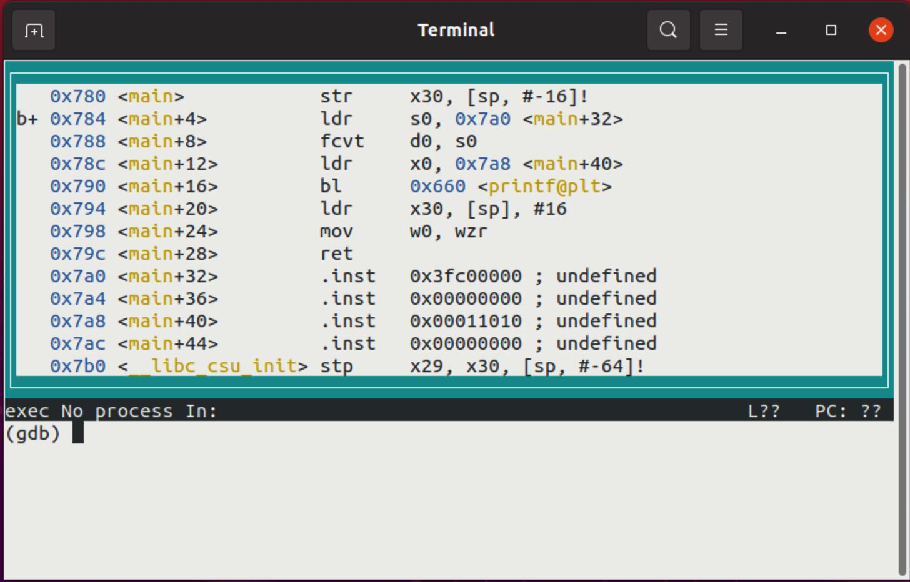

# Section 2 / Floating Point Literals

Recall that all AARCH64 instructions are 4 bytes long. Recall also that
this means that there are constraints on what can be specified as a
literal since the literal must be encoded into the 4 byte instruction.
If the literal is too large, an assembler error will result.

Given that floating point values are always at least 4 bytes long
themselves, using floating point literals is extremely constrained.
For example:

```asm
        fmov    d0, 1		// 1
        fmov    d0, 1.1		// 2
```

`Line 1` will pass muster but `Line 2` will cause an error.

To load a `float`, you could translate the value to binary and do
as the following:

```asm
        .text                                                       // 1 
        .global main                                                // 2 
        .align    2                                                 // 3 
                                                                    // 4 
main:   str        x30, [sp, -16]!                                  // 5 
        ldr        s0, =0x3fc00000                                  // 6 
        fcvt       d0, s0                                           // 7 
        ldr        x0, =fmt                                         // 8 
        bl         printf                                           // 9 
        ldr        x30, [sp], 16                                    // 10 
        mov        w0, wzr                                          // 11 
        ret                                                         // 12 
                                                                    // 13 
        .data                                                       // 14 
fmt:    .asciz    "%f\n"                                            // 15 
        .end                                                        // 16 
```

The above code is found [here](./t.s).

`Line 6` puts the translated value of 1.5 into `s0` (since the value
is a `float` it goes in an `s` register). The assembler performs some
magic getting a 32 bit value seemingly fit into a 32 bit instruction.
See [below](./literals.md#fitting-32-bits-into-a-32-bit-bag).

`Line 7` converts the single precision number into a double precision
number for printing.

*`printf()` only knows how to print double precision values. When you
specify a `float`, it will convert it to a `double` before emitting it.*

Translating `floats` and `doubles` by hand isn't a common practice for
humans, though compilers are happy to do so.

Instead for us humans, the assembler directives `.float` and `.double`
are used more frequently to specify `float` and `double` values putting
them into RAM.

The following example prints an array of floats and doubles:

```asm
        .global main                                                // 1 
        .text                                                       // 2 
        .align  2                                                   // 3 
                                                                    // 4 
counter .req    x20                                                 // 5 
dptr    .req    x21                                                 // 6 
fptr    .req    x22                                                 // 7 
        .equ    max, 4                                              // 8 
                                                                    // 9 
main:   stp     counter, x30, [sp, -16]!                            // 10 
        stp     dptr, fptr, [sp, -16]!                              // 11 
        ldr     dptr, =d                                            // 12 
        ldr     fptr, =f                                            // 13 
        mov     counter, xzr                                        // 14 
                                                                    // 15 
1:      cmp     counter, max                                        // 16 
        beq     2f                                                  // 17 
                                                                    // 18 
        ldr     d0, [dptr, counter, lsl 3]                          // 19 
        ldr     s1, [fptr, counter, lsl 2]                          // 20 
        fcvt    d1, s1                                              // 21 
        ldr     x0, =fmt                                            // 22 
        add     counter, counter, 1                                 // 23 
        mov     x1, counter                                         // 24 
        bl      printf                                              // 25 
        b       1b                                                  // 26 
                                                                    // 27 
2:      ldp     dptr, fptr, [sp], 16                                // 28 
        ldp     counter, x30, [sp], 16                              // 29 
        mov     w0, wzr                                             // 30 
        ret                                                         // 31 
                                                                    // 32 
        .data                                                       // 33 
fmt:    .asciz  "%d %f %f\n"                                        // 34 
d:      .double 1.111111, 2.222222, 3.333333, 4.444444              // 35 
f:      .float  1.111111, 2.222222, 3.333333, 4.444444              // 36 
                                                                    // 37 
        .end                                                        // 38 
```

The above code is found [here](./literals.s).

A number of interesting things in this source code:

* We use `.req` to give symbolic names to various registers. This can
help you in remembering which register is being used for what purpose.

* We use `.equ` to encode a small integer literal value to give it a
symbolic name, eliminating the use of a "magic number."

* `Lines 19` and `20` use address arithmetic to march through an
array of doubles (8 bytes each) and an array of floats (4 bytes each).

`Line 19` is equivalent to:

```c++
//   ldr     d0, [dptr, counter, lsl 3]
d0 = dptr[counter];
```

`counter` is multiplied by 8 then added to `dptr`.

`Line 20` is equivalent to:

`counter` is multiplied by 4 then added to `fptr`.

```c++
//   ldr     s1, [fptr, counter, lsl 2]
s1 = fptr[counter];
```

Cool huh?

## Fitting 32 bits into a 32 bit bag

AARCH64 instructions are 32 bits in width. Yet, `line 6` from
[this](./t.s) program reads:

```text
        ldr        s0, =0x3fc00000                                  // 6 
```

This appears to show a 32 bit constant being held in an instruction that
itself is 32 bits wide. Well, the Assembler does some magic. Let's see
what that magic is.

Build the program with the `-g` option to enable debugging using GDB.

```text
$ gcc -g t.s
```

Then launch GDB on the executable:

```text
$ gdb a.out
```

Set a breakpoint on line 6.

```text
(gdb) b 6
Breakpoint 1 at 0x784: file t.s, line 6.
(gdb)
```

Enter a cool GDB layout (one of several cool layouts):

```text
layout asm
```

You should see something like this:



We expected `line 6` to read:

```text
        ldr        s0, =0x3fc00000
```

Instead we find:

```text
b+ 0x784 <main+4>          ldr     s0, 0x7a0 <main+32>
```

Scan downward to find `0x7a0`:

```text
   0x7a0 <main+32>         .inst   0x3fc00000 ; undefined  
```

Hey look! Here's our literal float. The `.inst` is an ARM
specific GNU assembler directive what allows the programmer
to encode their own instruction. Note, the encoded instruction does not
have to make any sense - instead the compiler has emitted a make believe
instruction that happens to have the value of our literal.

What we're seeing the actual `line 6` doing is reaching ahead a short
distance to load the value of another "instruction" when really it is
our constant.

Let us take this explanation further. Notice we see:

```text
   0x78c <main+12>         ldr     x0, 0x7a8 <main+40>
```

where we expected:

```text
        ldr        x0, =fmt
```

Scan down to `0x7a8`:

```text
  0x7a8 <main+40>         .inst   0x00011010 ; undefined
```

`x0` is serving as a pointer to the format string of a call to
`printf()`. Let's follow the pointer...

```text
(gdb) x/s 0x00011010
0x11010:        "%f\n"
(gdb)
```

Magic.
