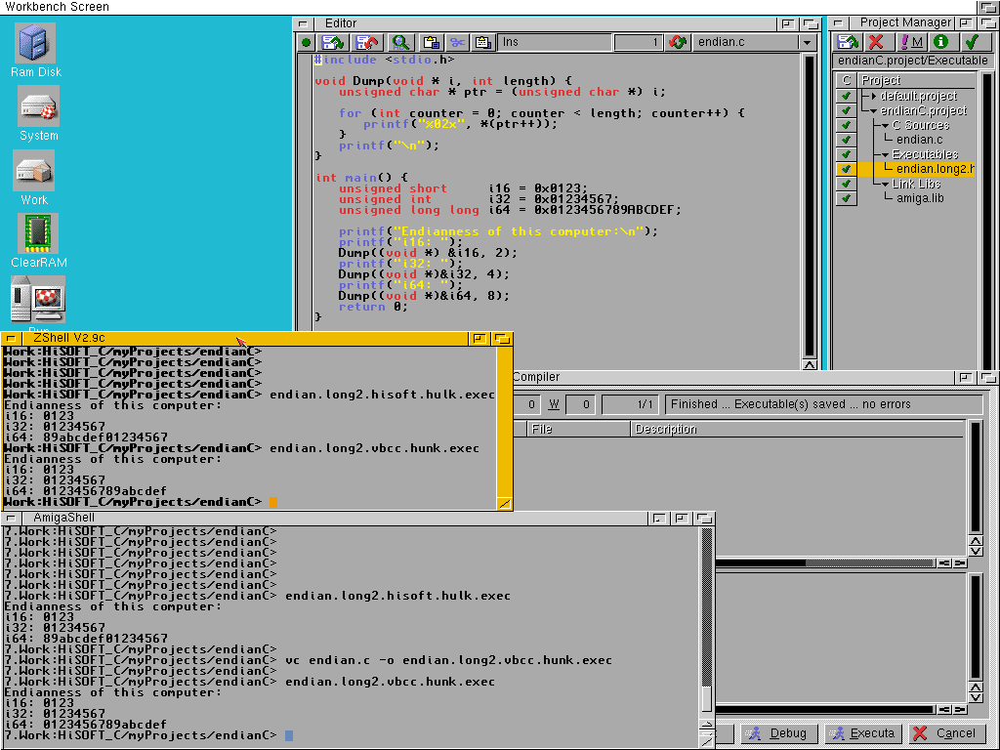
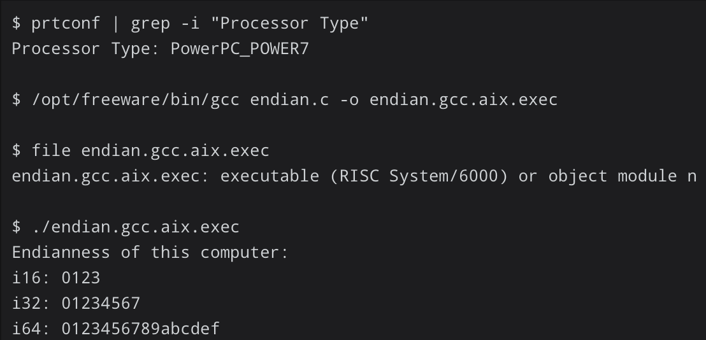
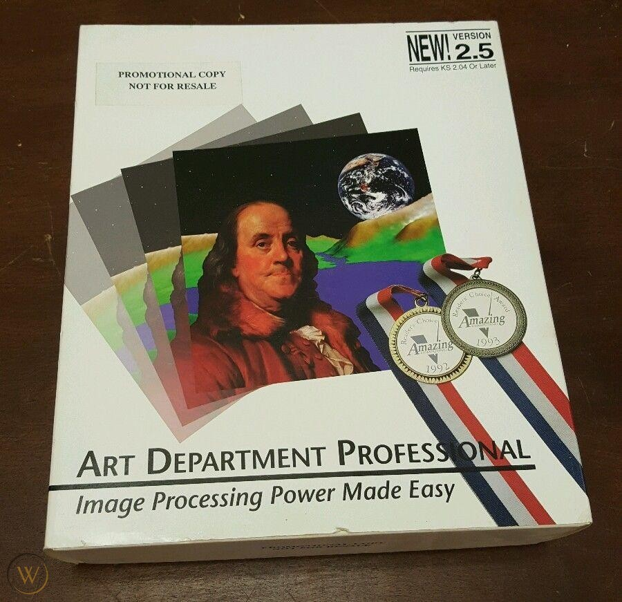
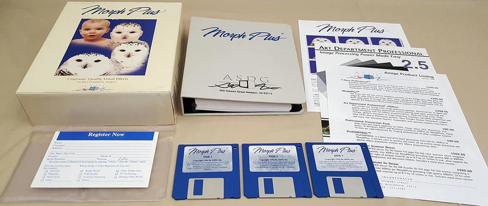

# Section 3 / Endianness

The first shock delivered in this chapter is that "endianness" is
actually a real word. Boom! Mind blown!
[Here](<https://en.wikipedia.org/wiki/Endianness>) is the Wikipedia
article on endianness.

Thank you for reading this chapter. My work here is done.

No, wait! There's more to talk about.

The TL;DR of endianness is this:

* suppose you have a pointer to a `short`

* is the byte at the address contained in the pointer the first byte
of the `short` or the second?

This extends to `int` and to `long` as well.

## Why talk about this?

Endianness is mostly hidden from you. The value of an `int` is the value
you think it is and how the `int` is constructed probably isn't on your
radar.

Endianness is a big deal for people who code network applications where
early on, a standard was required to determine which byte of an `int` is
the first one transmitted over the wire. Network Byte Order is big
endian. Most of todays very popular processors are little endian.

For us assembly language coders, endianness especially comes into play
when we're using our debuggers. When we examine memory, memory is a
linear stream of bytes. Without understanding endianness, you might be
confused about what you're seeing.

## Where do the terms come from?

In 1726, Jonathan Swift published an absolutely vicious political satire
which today we think of as a children's story: Gulliver's Travels. In
it, a sailor named Gulliver is thrust into the middle of two warring
nations, Lilliput and Blefuscu. The war, it turns out, is over which
end of a soft boiled egg one should open. The big end. Or the little
end.

Please read the entirety of Gulliver's Travels keeping in mind how
absolutely nasty Swift's portrayal of 18th century politics can be. You
won't be disappointed.

The classic cartoon version, Max Fleischer's 1939 masterpiece, doesn't
do the book justice.

## How do the terms apply?

A multi-byte quantity like a `short`, `int` or `long` has a big end
where the most significant byte lives and a little end, where the least
significant byte lives. Thus the terms...

If the most significant byte comes first, the architecture is said to
be big-endian. If the least significant byte comes first, it is little
endian. There's a little more to it than that, but not much.

**Notice I have not discussed strings.**

**And, notice I have not talked about bits.**

## Strings are not affected by endianness

A string is a series of distinct bytes. The `sizeof()` of a `char` is 1.
Its least significant byte is the same as its most significant byte.
Strings appear in memory in the order you expect.

## Bits are not affected by endianness

It is a common misconception that little- and big-endian alters the
order in which bits appear. They do not. Endianness affects only the
order in which bytes appear in a multi-byte integer (or floating
point) value.

## Code to visualize endianness

Please have a look at [this](./main.cpp) code.

```c++
int main() {                                                      // 26 
    int16_t i16 = 0x0123;                                         // 27 
    int32_t i32 = 0x01234567;                                     // 28 
    int64_t i64 = 0x0123456789ABCDEF;                             // 29 
                                                                  // 30 
    cout << hex << setfill('0');                                  // 31 
    cout << "Endianness of this computer:\n";                     // 32 
    cout << "i16: " << setw(16) << Dump(i16) <<
    " value: " << setw(16) << i16 << endl; // 33 
    cout << "i32: " << setw(16) << Dump(i32) << 
    " value: " << setw(16) << i32 << endl; // 34 
    cout << "i64: " << setw(16) << Dump(i64) << 
    " value: " << setw(16) << i64 << endl; // 35 
    cout << "If little endian, column 1 will not equal column 2.\n"; // 36 
    return 0;                                                     // 37 
}                                                                 // 38
```

In `main()` we define a `short` (`int16_t`), an `int` (`int32_t`) and a
`long` (`int64_t`) to have readily identifiable values. We define a
function that will return a string with the individual bytes of each
value broken into the order in which the bytes appear in memory.

Here is the function:

```c++
template <class T>                                                // 14 
string Dump(T & i) {                                              // 15 
    stringstream ss;                                              // 16 
    unsigned char * p = reinterpret_cast<unsigned char *>(&i);    // 17 
                                                                  // 18 
    ss << hex << setfill('0');                                    // 19 
    for (uint32_t counter = 0; counter < sizeof(T); counter++) {  // 20 
        ss << setw(2) << static_cast<int>(*(p++));                // 21 
    }                                                             // 22 
    return ss.str();                                              // 23 
}                                                                 // 24
```

You might not be familiar with templated functions. Notice line 14 tells
the compiler that the next function is templated and that `T` will stand
in for the type matching the parameter that is actually given to the
function.

Thus, at compile time, the compiler writes a different function for each
of `int`, `short` and `long`. When the compiler gets to the `sizeof()`
on line 20, the size of the "right" type is taken.

Using the templated approach, we need write this function only once
rather than three times (for each of `int`, `short` and `long`).

## Output on a little endian machine

Run on an ARM based machine:

```text
Endianness of this computer:
i16: 0000000000002301 value: 0000000000000123
i32: 0000000067452301 value: 0000000001234567
i64: efcdab8967452301 value: 0123456789abcdef
If little endian, column 1 will not equal column 2.
```

**Notice that the order of the bytes within each pair of bytes is
reversed.**

**AND. The order of each *pair* of bytes is reversed.**

In the `long`, the `ef` are the least significant 8 bits. Notice that
on a little endian machine, it is the first byte in the long in memory.

## Output on a big endian machine

We tried and tried to find a kind soul to run the above program on a
big-endian machine. Athanasios Pavlidis ran a C version of the
code on both an Amiga A4000/MC68040 and an Amiga A3000/MC68030. The
results were:

```text
Endianness of this computer:
i16: 0123
i32: 01234567
i64: 89abcdef01234567
```

Notice the values for `i16` and `i32` match the right hand column above.

The value for `i64` is borked in that we specified it in the C code as a
`long`. We then tried specifying the `long` as a `long long` but got the
same results.

Mr. Pavlidis tried a different tool chain and got the correct results.
Here is a screenshot:



For completeness, Mr. Pavlidis ran the code on the IBM Power PC
(System/6000) and got these correct results:



Athanasios Pavlidis has our appreciation and thanks.

## Can't the ARM swing both ways?

Yes. Technically yes. But.

The standard toolchain emits little endian code. It is a big task to
install the big-endian version of the toolchain.

Here is a quote from Wikipedia:

```text
ARM, C-Sky, and RISC-V have no relevant big-endian deployments, and can
be considered little-endian in practice.
```

## What is Intel?

The common Intel processors are also little-endian.

## So what's big-endian?

IBM mainframes and the Motorola 68K family come to mind. See above.

## Nostalgia

The author worked extensively in the Amiga ecosystem from the middle
1980s to the middle 1990s. Here are some products from his company:





In those days we sold software by the pound! Look at that manual!
